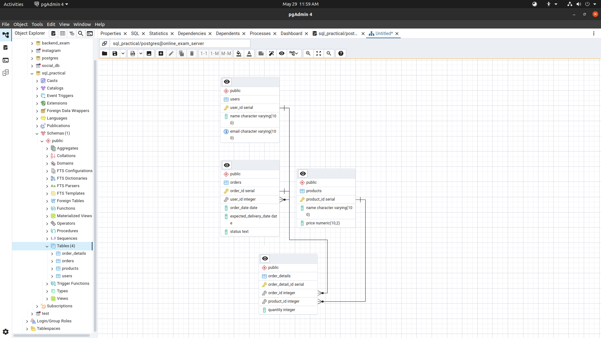
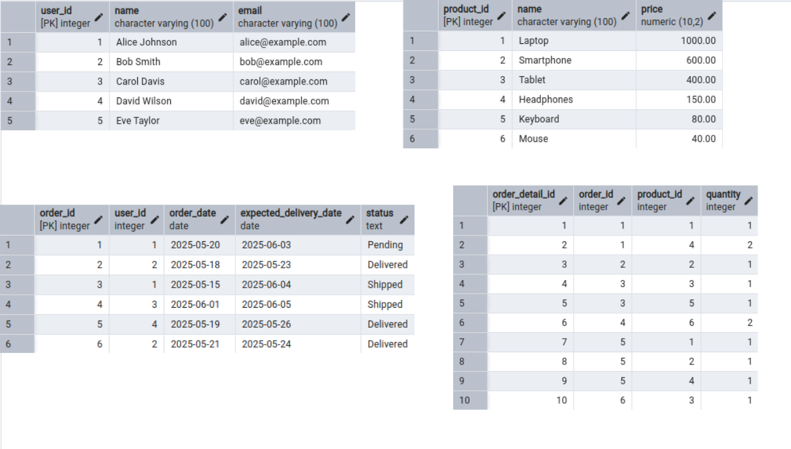
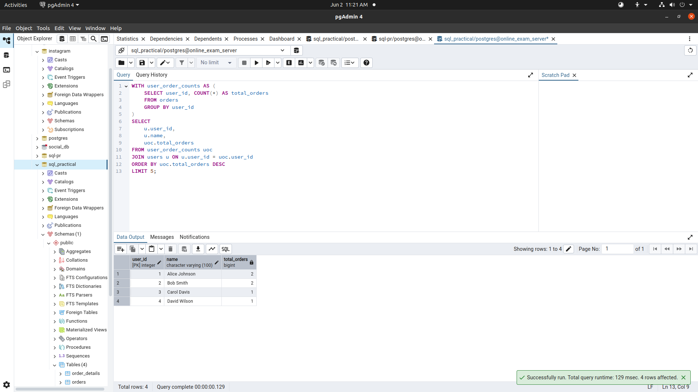

# Database Schema and Operations

---

## Database Schema

### User Table

The `users` table stores information about customers.

```sql
CREATE TABLE users (
    user_id SERIAL PRIMARY KEY,
    name VARCHAR(100) NOT NULL,
    email VARCHAR(100) UNIQUE NOT NULL
);
```


---

### Product Table

The `products` table stores information about products available for purchase.

```sql
CREATE TABLE products (
    product_id SERIAL PRIMARY KEY,
    name VARCHAR(100) NOT NULL,
    price NUMERIC(10, 2) NOT NULL CHECK (price >= 0)
);
```


---

### Orders Table

The `orders` table stores information about customer orders.

```sql
CREATE TABLE orders (
    order_id SERIAL PRIMARY KEY,
    user_id INT REFERENCES users(user_id),
    order_date DATE NOT NULL,
    expected_delivery_date DATE NOT NULL,
    status TEXT CHECK (status IN ('Pending', 'Shipped', 'Delivered', 'Cancelled')) NOT NULL
);
```


---

### Order Details Table

The `order_details` table stores information about the products included in each order.

```sql
CREATE TABLE order_details (
    order_detail_id SERIAL PRIMARY KEY,
    order_id INT REFERENCES orders(order_id),
    product_id INT REFERENCES products(product_id),
    quantity INT NOT NULL DEFAULT 1 CHECK (quantity > 0)
);
```


---

### Schema Diagram



---

## Data Insertion

### Insert Users

```sql
INSERT INTO users (name, email) VALUES
('Alice Johnson', 'alice@example.com'),
('Bob Smith', 'bob@example.com'),
('Carol Davis', 'carol@example.com'),
('David Wilson', 'david@example.com'),
('Eve Taylor', 'eve@example.com');
```
---

### Insert Products

```sql
INSERT INTO products (name, price) VALUES
('Laptop', 1000.00),
('Smartphone', 600.00),
('Tablet', 400.00),
('Headphones', 150.00),
('Keyboard', 80.00),
('Mouse', 40.00);
```
---

### Insert Orders

```sql
INSERT INTO orders (user_id, order_date, expected_delivery_date, status) VALUES
(1,'2025-05-20', '2025-06-03', 'Pending'),
(2,'2025-05-18', '2025-05-23', 'Delivered'),
(1,'2025-05-15', '2025-06-04', 'Shipped'),
(3,'2025-06-01', '2025-06-05', 'Shipped'),
(4,'2025-05-19', '2025-05-26', 'Delivered'),
(2,'2025-05-21', '2025-05-24', 'Delivered');
```
---

### Insert Order Details

```sql
INSERT INTO order_details (order_id, product_id, quantity) VALUES
(1, 1, 1),
(1, 4, 2),
(2, 2, 1),
(3, 3, 1),
(3, 5, 1),
(4, 6, 2),
(5, 1, 1),
(5, 2, 1),
(5, 4, 1),
(6, 3, 1);
```

---

## Operations

### 1. Fetch User Order List

Fetch all user orders with details including customer name, product names, order date, and expected delivery time in days.

```sql
SELECT
    u.name AS customer_name,
    p.name AS product_name,
    o.order_date,
    CASE
        WHEN o.expected_delivery_date > CURRENT_DATE THEN 
            'within ' || (o.expected_delivery_date - CURRENT_DATE) || ' days'
        ELSE 'Delivered'
    END AS expected_delivery_date
FROM
    users AS u
    JOIN orders AS o ON u.user_id = o.user_id
    JOIN order_details AS od ON o.order_id = od.order_id
    JOIN products AS p ON od.product_id = p.product_id;

```


---

### 2. Summary Reports

#### A. All Undelivered Orders

Fetch all orders that have not been delivered yet.

```sql
SELECT
    o.order_id,
    u.name AS customer_name,
    o.status,
    o.order_date,
    o.expected_delivery_date
FROM orders o
JOIN users u ON o.user_id = u.user_id
WHERE o.status != 'Delivered';
```


---

#### B. 5 Most Recent Orders

Fetch the 5 most recent orders.

```sql
SELECT
    o.order_id,
    u.name AS customer_name,
    o.order_date,
    o.status
FROM orders o
JOIN users u ON o.user_id = u.user_id
ORDER BY o.order_date DESC
LIMIT 5;
```


---

#### C. Top 5 Active Users

Fetch the top 5 users with the most number of orders.

```sql
WITH user_order_counts AS (
    SELECT user_id, COUNT(*) AS total_orders
    FROM orders
    GROUP BY user_id
)
SELECT
    u.user_id,
    u.name,
    uoc.total_orders
FROM user_order_counts uoc
JOIN users u ON u.user_id = uoc.user_id
ORDER BY uoc.total_orders DESC
LIMIT 5;
```



---

#### D. Inactive Users

Fetch users who have not placed any orders.

```sql
SELECT
    u.user_id,
    u.name
FROM users u
LEFT JOIN orders o ON u.user_id = o.user_id
WHERE o.order_id IS NULL;
```


---

#### E. Top 5 Most Purchased Products

Fetch the top 5 products with the highest purchase quantities.

```sql
WITH product_sales AS (
    SELECT
        product_id,
        SUM(quantity) AS total_quantity
    FROM order_details
    GROUP BY product_id
)
SELECT
    p.product_id,
    p.name,
    ps.total_quantity
FROM product_sales ps
JOIN products p ON p.product_id = ps.product_id
ORDER BY ps.total_quantity DESC
LIMIT 5;
```


---

#### F. Most Expensive and Cheapest Orders

Fetch the most expensive and cheapest orders.

```sql
WITH order_totals AS (
    SELECT
        o.order_id,
        u.name AS customer_name,
        SUM(p.price * od.quantity) AS total_amount
    FROM orders o
    JOIN users u ON o.user_id = u.user_id
    JOIN order_details od ON o.order_id = od.order_id
    JOIN products p ON od.product_id = p.product_id
    GROUP BY o.order_id, u.name
),
ranked_orders AS (
    SELECT *,
           RANK() OVER (ORDER BY total_amount ASC) AS min_rank,
           RANK() OVER (ORDER BY total_amount DESC) AS max_rank
    FROM order_totals
)
SELECT order_id, customer_name, total_amount, 'Cheapest' AS order_type
FROM ranked_orders
WHERE min_rank = 1

UNION ALL

SELECT order_id, customer_name, total_amount, 'Most Expensive' AS order_type
FROM ranked_orders
WHERE max_rank = 1;
```

